# LS-PrePost 4.8

**Release Data**:

**Major new features of the 4.8 series, compared to 4.7:**

[toc]

##  Multiphysics Solution

### Open

1. Open the “Multiphysics Solution” interface by checking on the “Solution Explorer” item under the “View” menu.

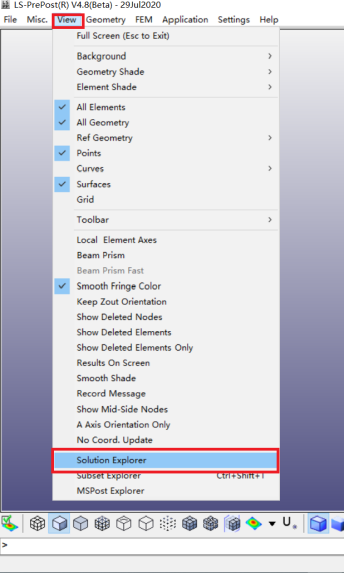

2. Pop up the solution explorer file operation menus by right clicking on the top tree item in the solution explorer.

   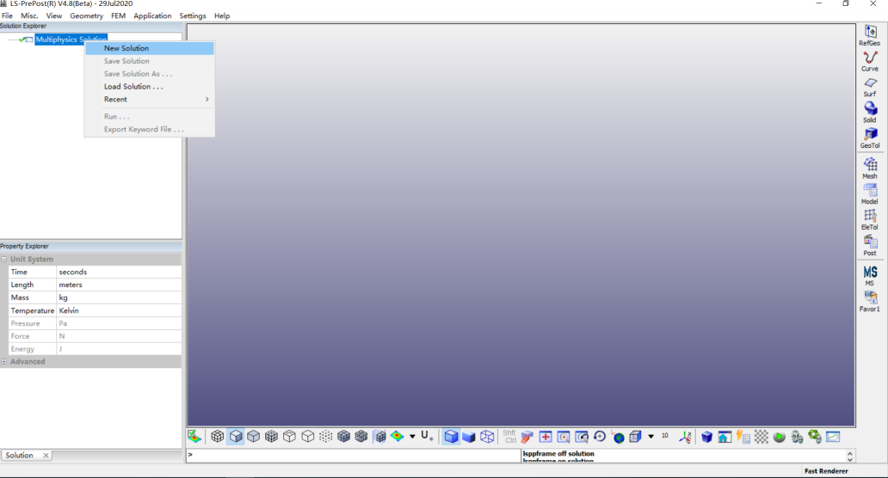

   * *“New Solution” can create a new solution file.*

   * *“Save Solution” can save the current solution data to the already named solution file.*

   * *“Save Solution As...” can save the current solution data to a new solution file with a new name.*

   * *“Load Solution...” can load a saved solution file to the solution explorer.*

   * *“Recent” can list the latest 5 opened solution files.*

   * *“Run” can open the “LS-Run” and call the “LS-DYNA” solver to solve the defined solution file.And this item can also save the solution data to a “.solution” file and a corresponding keyword file.*

   * *“Export Keyword File...” can save the solution data to corresponding keyword file.

### Create New Solution

1. Select the “New Solution” menu item and pop up the “New Solution” interface.

   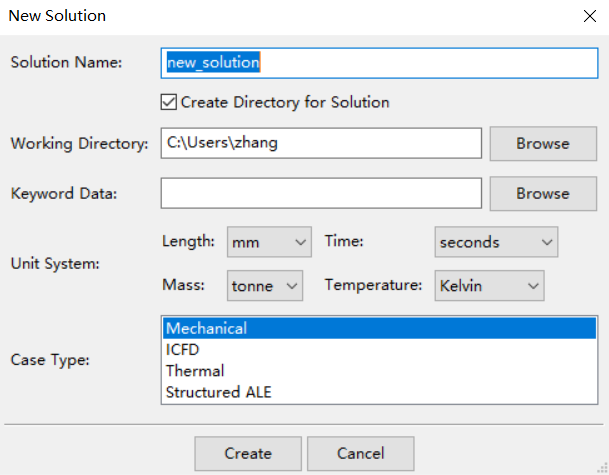

   * *This interface can name the new solution file and set the working directory.*

   * *When the current model data is not the correct one for the new solution file, user can use the “Keyword Data” option to load a keyword file.*

   * *The unit system is based on the loaded keyword file or the current opened model data in LS-Prepost.*

   * *Solution Explorer can support “Mechanical”, “ICFD”, “Thermal(structure)” and “Structured ALE” four case types. User can choose the right one to define the whole solution tree structure.*

     

### Solution Tree Structure

1. The tree structure contains three layers:

   * *The top layer is called “Multiphysics Solution”, in this layer user can set the unit system and keyword data version for the whole analysis.*

   * *The second layer is called “Case”.*

     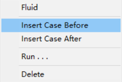

   * *Different cases have the same model data(the materials of parts in different case can have different properties.), connectors data and contact data if these tree items exist in one case. So the case operations in right-clicked menu of the case item can copy the case data to other cases which can be added before or after the current case. User can choose to call the “LS-DYNA” solver from any case by clicking on the “Run...” menu item. If user choose to run from a selected case, a “.lsda” file which is got from the previous case is necessary.*

   * *The third layer is different case types. Different case types may have different tree structures. User select correct case type when create a new solution file from the “New Solution” interface, LS-Prepost will build whole tree structure automatically.*

2. The solution data contains two parts, one is the tree node in the tree structure and the other one is called property gird which is attached to the corresponding tree node. User can select different tree nodes and set their related property data in the property gird.

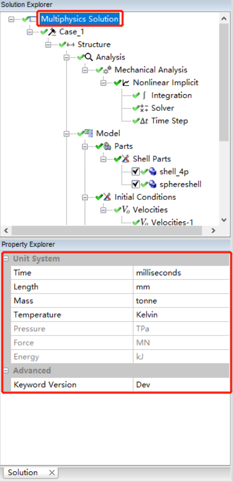

### Mechanical and Thermal Case

1. For “Mechanical” and “Thermal” case types, the whole tree structure both contains three parts:Analysis, Model,Output. It can be built like the following picture.

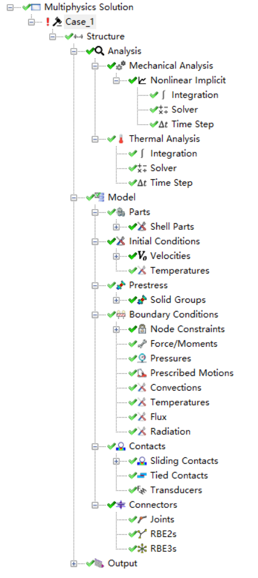

2. In the “Analysis” item user can set the solver data, time step data, and integration data. For “Mechanical”, the solution only support the “Nonlinear Implicit” solver for now. If user select the “Mechanical” and “Thermal” case type, the tree data under the “Analysis” item is like what the picture shows.

3. The “Model” item contains fem model data, initial conditions data, boundary conditions data, prestress data, contact data, connector data.

   * *Different analysis type mean different boundary conditions data. The “Node Constraints”, “Force/Moments”,”Pressures” and ”Prescribed Motions” belong to “Mechanical” analysis. And “Convection”, “Temperature”, “Flux” and “Radiation” are related to “Thermal” analysis.**

   * *The material property in part item is defined by a new material library. In LS-Prepost executable folder, LS-Prepost add a sample material database file called “material.xml”. It is in XML and keyword format. Users can add their own material databases as the LS-Prepost “built-in” database format. The thermal material data will be shown when the thermal analysis exists in the solution tree structure.*

     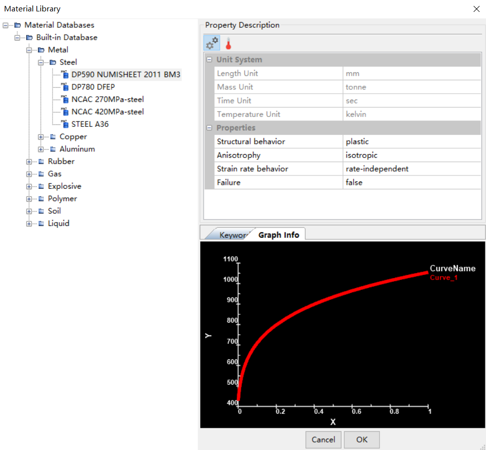

   * *Contact item only support “Sliding Contact”, “Tied Contact” and “Transducer” three types for now. The data for thermal analysis is in every contact item property gird.*

4. The “Output” item can output the defined “Node Data” and “Element Data” and some default result files like “glstat”, “rcforc”, “bndout”, ”spcforc”, “matsum”, “secforc” , “sleout” and so on.

5. For now, the post analysis is added into the property grid for part items and contact items. And user can switch the item property between “pre” and “post” button. If users change any “pre” data, they need to rerun the current case to update the post data. When users choose to rerun the case, the case data after the selected one will be updated too.

   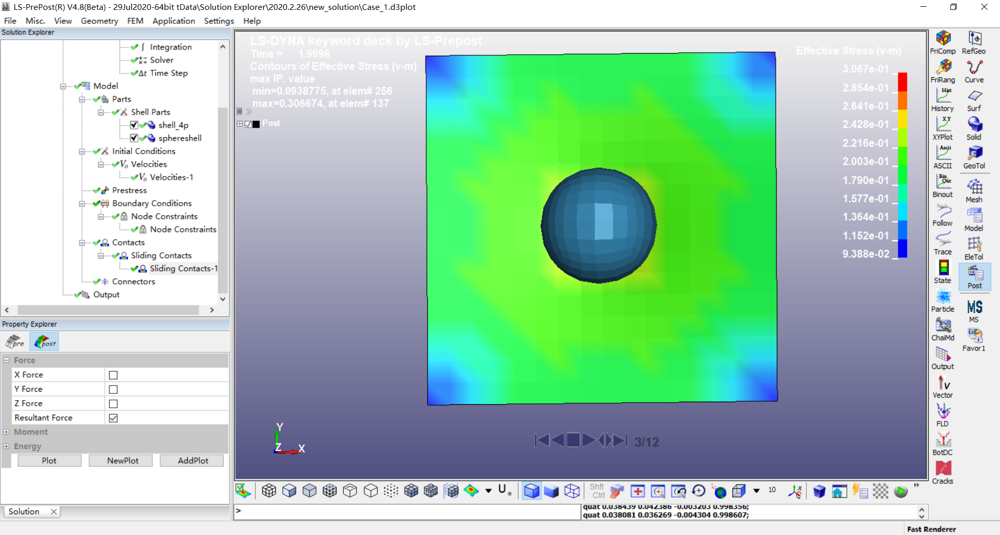

   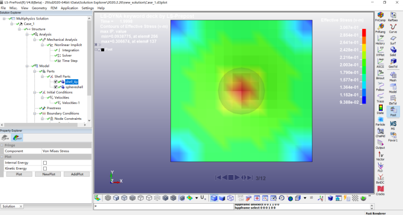

   

### ICFD

The ICFD type may build a tree structure as the following picture shown. It uses the same solution data format(tree nodes and related property grid). ICFD has its special items which are related to the ICFD analysis.

1. Now solution explorer supports these six analysis types, and they are “Turbulent”, “Thermal”, “FSI”, “DEM Coupling”, “Free Surface” and “RTM”. Different analysis types have different properties.

2. Users need to define their own materials under “Material” item and mesh data under the “Mesh” item.

3. The model data is came from the loaded keyword file in “New Solution” interface or the current opened model data in LS-Prepost.

4. In “Output” item, users can set the output result data for ICFD analysis.

   

### Structured-ALE

The Structured-ALE type may build a tree structure using the same solution data format(tree nodes and their related property grid) as the following picture shown.

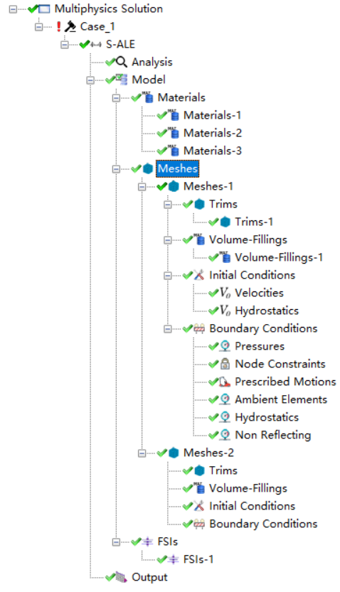

1. If users want to do a “FSI” analysis, they need to load the fem keyword data when create the new solution file or use the already opened model data in LS-Prepost. The “FSI” analysis data can be set under the “FSI” items.

2. The “Trim”, “Volume-Filling”, “Initial Conditions” ,“Boundary Conditions” are all based on the defined “Mesh”. And the properties about the mesh is like below picture.

   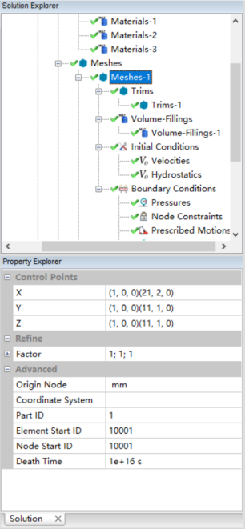

3. The “Boundary Conditions” can support six different types: “Pressure”, “Node Constraint”, “Prescribed Motion”, “Ambient Element”, “Hydro static” and “Non Reflecting”.

   

### Solution Property

Solution explorer defines some properties which will call the LS-Prepost other powerful functions.

1. Define Set Data: clicking the first button will list all defined set data in current model and clicking the second button will confirm what data users have selected on the model.

   * *Node Set:* 
   * *Part Set:* 

   * *Shell Element Set:* 

   * *Segment Set:* 

2. Define Local Coordinate System: clicking the first button will list all the defined local coordinate system in current model and clicking the second button will pop up the “Define Local Coordinate System” interface. 

   

   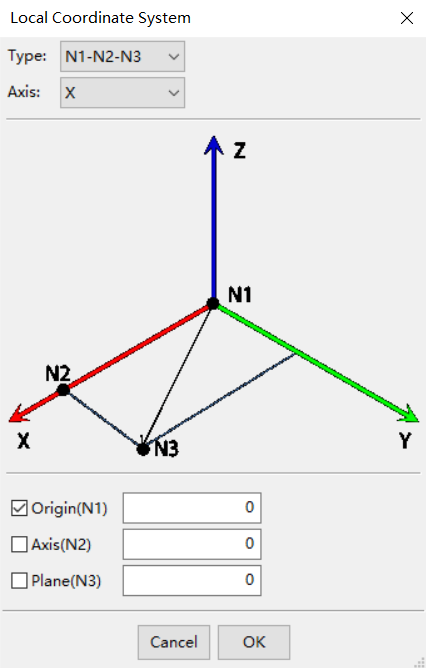

3. Define Material: clicking the button will pop up the “Material Library” interface and list all the material databases in LS-Prepost.

   

   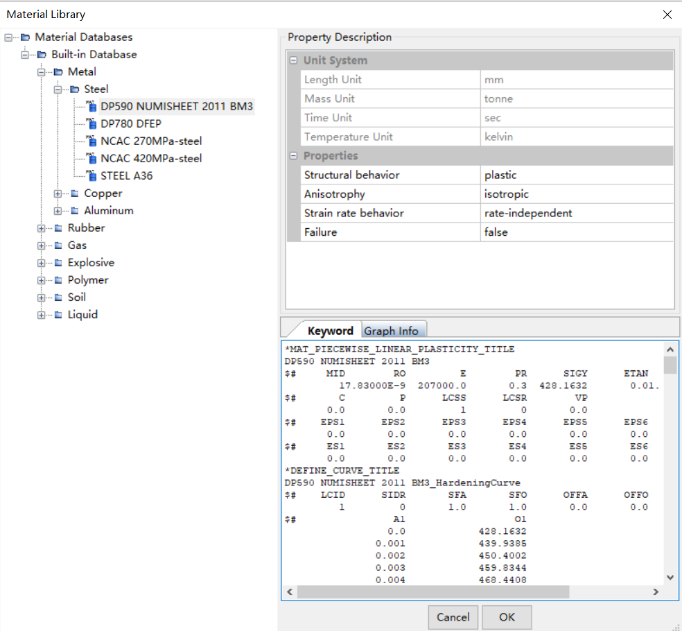

4. Define Curve: clicking the first button will switch current property among constant, curve, curve function, function four types, and clicking the second button will list all the defined curve data, clicking the third button will pop up a interface to input all the curve data.

   

   

   

   

   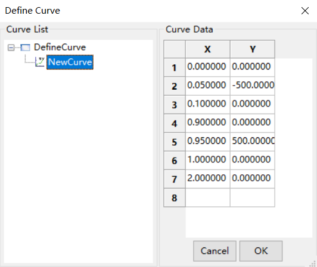
   
   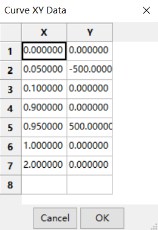

---

- [x] 

---

